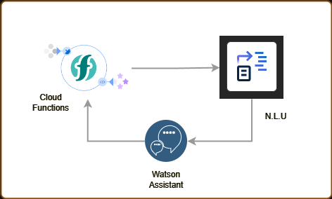
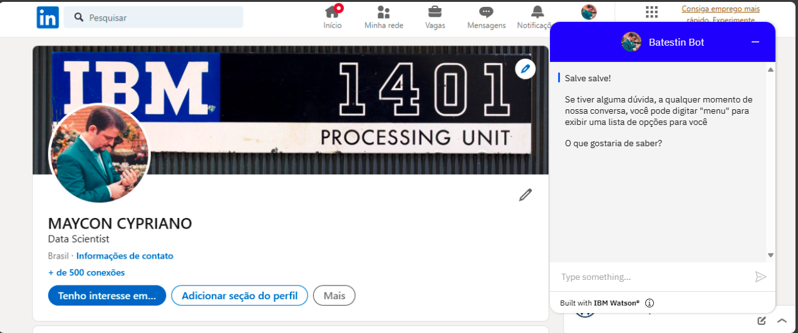
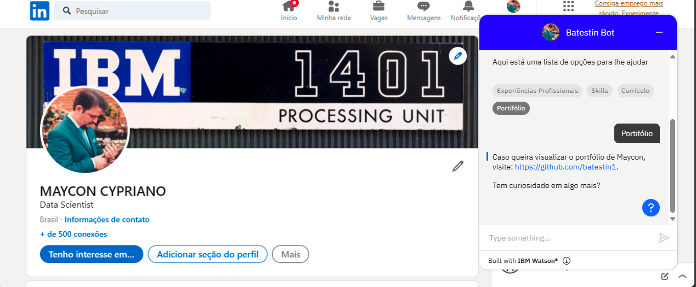

<h1 align="center">
  
</h1>

<h3 align="center">BATESTIN BOT</h3>
<h3 align="center">=================</h3>

<h3>Architecture</h3>

  

<h3>About the project</h3>

The project is a chatbot developed by <b> Watson Assistant </b> and enhanced in <b> TELEGRAM BOT </b> using <b> Azure Bot Framework.</b> All services are connected between itself running on the LITE plan and easy to maintain.
The chatbot is self-responsive and answers questions directed to the Maycon persona. The intention is to help recruiters or any user to obtain information about Maycon in a quick and practical way..

<h3>In this Repository</h3>

You will find 3 folders containing Entities, Content and Skill files 

1. Entities -> Contains files referring to entities that permeate the chatbot. They are in CSV format.
2. Content -> Contains the dialog flows proposed by the chatbot. It is in JSON format.
3. Skill -> Contains the project as a whole, except its identification keys and accesses. It is in JSON format.
4. Strealimt -> Contains the project as streamlit python for app device.
5. Train_files -> files to train the model project.

<h3>How to Run</h3>

1. Have a telegram account
2. Add account [BATESTINBOT](https://batestinbot.streamlit.app/)

<h3>Result</h3>

  
  

