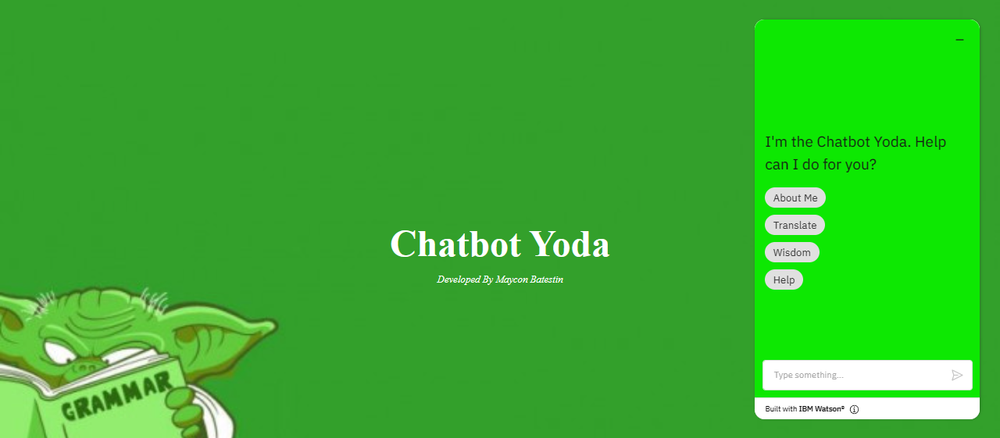
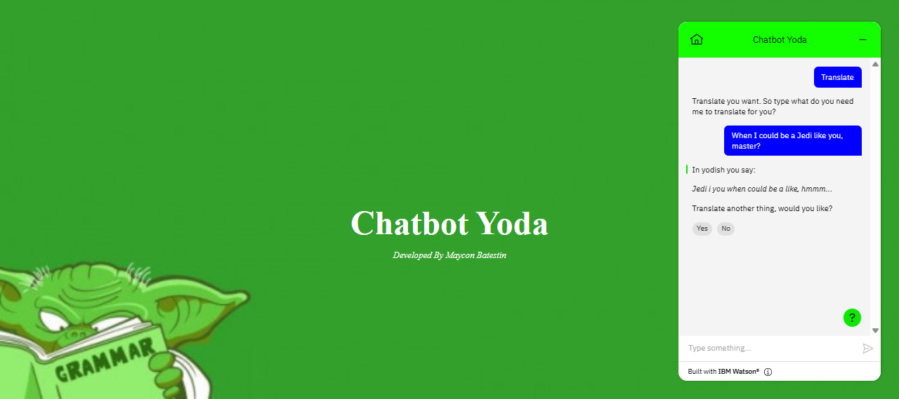

<h1 align="center">
  
</h1>

<h3 align="center">Yoda Bot</h3>
<h3 align="center">=================</h3>

<h3>Architecture</h3>

  

<h3>About the project</h3>

This chatbot was developed thinking about the integration of Watson Studio tools. One of them is the famous Natural Language Understanding, a very powerful natural language processor that can identify feelings and perform grammar analysis.
The chatbot's challenge was to develop an intelligence that could use "yodish" to translate its messages.
What is yodish? It is the language of Yoda, the character from the Star Wars series. The main feature of this language is that it places verbs (mainly auxiliary verbs) after the object and the subject (an object-subject-verb format). An example of Yoda's speech: "When you are nine hundred years old, looking good is difficult".
With this principle, we structured NLU's intelligence to understand its message that usually comes as Subject-verb-Object and invert the order.

<h3>In this Repository</h3>

You will find 5 folders containing Entities, Content and Skill files 

1. Entities -> Contains files referring to entities that permeate the chatbot. They are in CSV format.
2. Content -> Contains the dialog flows proposed by the chatbot. It is in JSON format.
3. Skill -> Contains the project as a whole, except its identification keys and accesses. It is in JSON format.
4. Intents ->  Contains files referring to intents that permeate the chatbot. They are in CSV format
5. Script -> Contains the file main.py with the code about Natural Language Undestading for pratical studies.

<h3>How to Run</h3>

1. Click here to interacte [YODA BOT](https://batestin1.github.io/yodabot/)

<h3>Result</h3>

  
  

