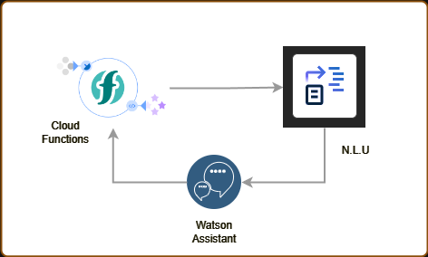
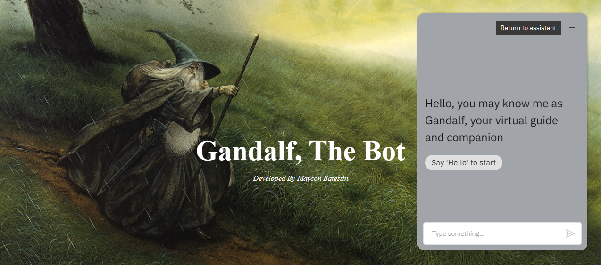
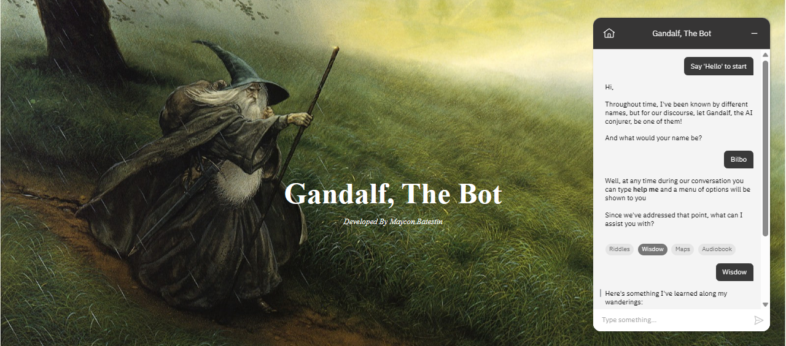

<h1 align="center">
  
</h1>

<h3 align="center">Gandalf, the bot</h3>
<h3 align="center">=================</h3>

<h3>Architecture</h3>

  

<h3>About the project</h3>

This is a more detailed chatbot that brings an almanac of things from the Lord of the Rings universe. Assuming the persona of Gandalf, the chatbot has puzzle options, view maps, listen to audiobooks and give wise advice to every user.
It was built using IBM's NLU which allows you to work emotions into words. These emotions are used to perform riddles in the style of the Lord of the Rings universe.

<h3>In this Repository</h3>

You will find 3 folders containing Entities, Content and Skill files 

1. Entities -> Contains files referring to entities that permeate the chatbot. They are in CSV format.
2. Content -> Contains the dialog flows proposed by the chatbot. It is in JSON format.
3. Skill -> Contains the project as a whole, except its identification keys and accesses. It is in JSON format.
4. Intents ->  Contains files referring to intents that permeate the chatbot. They are in CSV format
5. Script -> Contains the file main.py with the code about Natural Language Undestading for pratical studies.

<h3>How to Run</h3>

1. Click here to interacte [GANDALF THE BOT](https://batestin1.github.io/gandalf/)

<h3>Result</h3>

  
  

